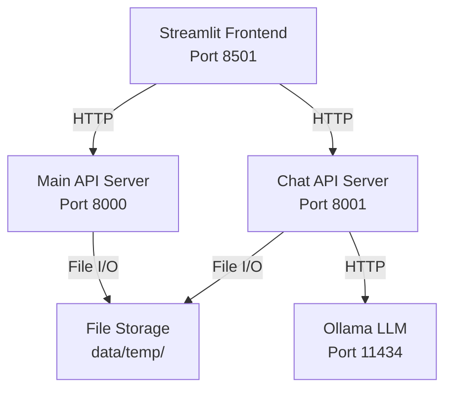

# 🔧 Technical Guide - AI Social Support Application

## 🏗️ Architecture Overview

### System Components



### Technology Stack

| Component | Technology | Version | Purpose |
|-----------|------------|---------|---------|
| Frontend | Streamlit | 1.49.1 | User interface |
| Backend API | FastAPI | 0.116.2 | REST API server |
| Chat Service | FastAPI | 0.116.2 | AI chat endpoint |
| LLM | Ollama + qwen2:1.5b | 0.11.11 | Language model |
| Data Storage | JSON Files | - | Persistent storage |
| HTTP Client | Requests | - | API communication |

## 📁 Project Structure

```
ai-social-support/
├── backend/
│   ├── api/
│   │   ├── simple_server.py     # Main API server
│   │   ├── chat_server.py       # Chat API server
│   │   └── main.py              # Full API (future)
│   ├── agents/                  # AI agents (future)
│   ├── models/                  # Data models
│   └── services/                # Business logic
├── frontend/
│   └── app.py                   # Streamlit application
├── data/
│   ├── temp/                    # JSON persistence
│   │   ├── applications.json    # Application data
│   │   └── processing.json      # Status data
│   └── uploads/                 # File uploads
├── docs/                        # Documentation
├── requirements.txt             # Python dependencies
├── .env                         # Configuration
└── README.md                    # Main documentation
```

## 🔧 Core Components

### 1. Simple Server (simple_server.py)

**Purpose**: Main API for application processing and document upload

**Key Features**:
- Application submission and retrieval
- Document upload with validation
- File-based persistence
- Status tracking
- Analytics endpoints

**Main Endpoints**:
```python
POST /applications/submit          # Submit new application
GET  /applications/{id}/details    # Get application details
POST /applications/{id}/documents/upload  # Upload documents
GET  /applications/{id}/status     # Get processing status
GET  /health                       # Health check
```

**Data Persistence**:
```python
def save_data():
    """Save applications and processing status to JSON files"""
    with open(APPLICATIONS_FILE, 'w') as f:
        json.dump({
            'applications': applications_db,
            'counter': application_counter
        }, f, indent=2)
```

### 2. Chat Server (chat_server.py)

**Purpose**: AI-powered chat assistance with optimized responses

**Key Features**:
- Hybrid instant/LLM responses
- Ollama integration
- Optimized parameters for speed
- Context-aware assistance

**Optimization Settings**:
```python
"options": {
    "temperature": 0.2,    # Consistency
    "top_p": 0.7,         # Focus
    "top_k": 10,          # Speed
    "num_predict": 100    # Conciseness
}
```

**Response Strategy**:
```python
# Instant responses for common queries
if prompt_lower in ["hi", "hello", "hey"]:
    return "👋 Hello! I'm your AI Social Support Assistant..."

# LLM for complex questions
response = await ollama_api_call(prompt)
```

### 3. Streamlit Frontend (app.py)

**Purpose**: User interface with multiple tabs and real-time interaction

**Key Features**:
- Multi-tab interface
- Real-time chat
- File upload with validation
- Session state management
- Error handling

**Tab Structure**:
```python
tab1, tab2, tab3, tab4, tab5 = st.tabs([
    "🏠 Application Form",
    "📄 Document Upload",
    "💬 Interactive Assistant",
    "📊 Application Results",
    "📈 Analytics Dashboard"
])
```

## 🔀 Data Flow

### Application Submission Flow

1. **User Input**: Form data entered in Streamlit
2. **Validation**: Client-side validation and formatting
3. **API Call**: POST to `/applications/submit`
4. **Processing**: Server validates and stores data
5. **Persistence**: Data saved to `applications.json`
6. **Response**: Application ID returned to frontend
7. **UI Update**: Session state updated, chat message added

### Document Upload Flow

1. **File Selection**: User selects files in Streamlit
2. **Type Classification**: User assigns document types
3. **Validation**: File size, format, and type validation
4. **API Call**: POST to `/applications/{id}/documents/upload`
5. **Storage**: File metadata stored (actual files simulated)
6. **Persistence**: Updated data saved to JSON
7. **Status Update**: Processing status updated

### Chat Interaction Flow

1. **User Message**: Text input in chat interface
2. **Preprocessing**: Message cleaning and encoding
3. **Response Strategy**: Check for instant response patterns
4. **LLM Call**: If complex, call Ollama API
5. **Response Processing**: Format and validate response
6. **UI Update**: Display response with timestamp

## 🔐 Security & Validation

### Input Validation

```python
# Emirates ID validation
if emirates_id and len(emirates_id.replace("-", "").replace(" ", "")) < 15:
    errors.append("Emirates ID format appears invalid")

# Email validation (built-in)
email_pattern = r'^[a-zA-Z0-9._%+-]+@[a-zA-Z0-9.-]+\.[a-zA-Z]{2,}$'

# File validation
ALLOWED_TYPES = ["pdf", "jpg", "jpeg", "png", "xlsx", "docx"]
MAX_FILE_SIZE = 200 * 1024 * 1024  # 200MB
```

### Error Handling

```python
try:
    # API operation
    response = requests.post(url, json=data, timeout=10)
    if response.status_code == 200:
        return response.json()
except requests.exceptions.Timeout:
    return {"error": "Request timed out"}
except requests.exceptions.ConnectionError:
    return {"error": "Service unavailable"}
except Exception as e:
    return {"error": f"Unexpected error: {str(e)}"}
```

## ⚡ Performance Optimizations

### LLM Optimization

**Model Selection**: qwen2:1.5b chosen for optimal speed/quality balance
- Size: 934MB (smaller than alternatives)
- RAM usage: ~2GB
- Response time: 1-6 seconds

**Parameter Tuning**:
```python
# Speed optimizations
"temperature": 0.2,     # Reduced for consistency
"top_p": 0.7,          # Reduced for focus
"top_k": 10,           # Reduced for speed
"num_predict": 100     # Reduced for conciseness
"timeout": 5.0         # Quick timeout for fallback
```

### Response Time Optimization

**Instant Responses** (<0.03s):
- Common greetings
- FAQ patterns
- Pre-defined responses

**Fast LLM Responses** (5-6s):
- Complex questions
- Context-aware responses
- Custom queries

### Data Persistence Optimization

**File-based Storage Benefits**:
- No database setup required
- Fast read/write operations
- Easy backup and recovery
- Human-readable format
- Version control friendly

```python
# Efficient JSON operations
def load_data():
    """Load data with error handling and type conversion"""
    applications = {int(k): v for k, v in data.items()}
    return applications, processing, counter

def save_data():
    """Atomic save operation"""
    with tempfile.NamedTemporaryFile(mode='w', delete=False) as tmp:
        json.dump(data, tmp, indent=2)
        os.replace(tmp.name, APPLICATIONS_FILE)
```

## 🧪 Testing & Debugging

### Health Check Endpoints

```bash
# System health check
curl http://localhost:8000/health
curl http://localhost:8001/chat/health
curl http://localhost:11434/api/tags
```

### Debug Information

**Application State**:
```python
# Check application data
cat data/temp/applications.json | jq '.'

# Check processing status
cat data/temp/processing.json | jq '.'
```

**Ollama Status**:
```bash
# Check running models
ollama ps

# Check available models
ollama list

# Model information
ollama show qwen2:1.5b
```

### Performance Monitoring

```python
# Response time measurement
import time
start_time = time.time()
# ... operation ...
response_time = time.time() - start_time
```

## 🔄 Configuration Management

### Environment Variables (.env)

```env
# Core settings
OLLAMA_HOST=http://localhost:11434
OLLAMA_MODEL=qwen2:1.5b
API_HOST=0.0.0.0
API_PORT=8000
FRONTEND_PORT=8501

# File settings
UPLOAD_DIR=./data/uploads
MAX_FILE_SIZE=10485760

# Performance
LOG_LEVEL=INFO
```

### Model Configuration

**Switch Models**:
```env
# For speed (current)
OLLAMA_MODEL=qwen2:1.5b

# For quality
OLLAMA_MODEL=llama3.2:3b

# For balance
OLLAMA_MODEL=phi3:3.8b
```

### Chat Settings

```python
class ChatSettings:
    temperature = 0.2
    top_p = 0.7
    top_k = 10
    num_predict = 100
    timeout = 5.0
    system_prompt = "You are a UAE Social Support Assistant..."
```

## 🚀 Deployment Considerations

### Development Deployment
- Three terminal setup
- Live reload enabled
- Debug mode active
- File-based persistence

### Production Deployment (Future)
- Process manager (PM2, systemd)
- Database backend
- Load balancing
- SSL/TLS termination
- Monitoring and logging

### Scalability Considerations
- Current: Single user, local storage
- Future: Multi-user, database, caching
- Resource requirements scale with users
- LLM model can be shared across users

## 📊 System Metrics

### Current Performance

| Metric | Value | Target |
|--------|-------|--------|
| Startup time | ~30s | <60s |
| Simple chat response | <0.03s | <0.1s |
| Complex chat response | 5-6s | <10s |
| Form submission | <1s | <2s |
| Document upload | 1-3s | <5s |
| Memory usage | ~4GB | <8GB |

### Monitoring Points

```python
# Key metrics to monitor
- Response times per endpoint
- Memory usage per component
- Error rates and types
- User session duration
- Document processing times
- LLM model performance
```

## 🔮 Future Enhancements

### Version 2.0 Roadmap

**Multi-Agent System**:
```python
# Planned agent architecture
- Orchestrator Agent: Workflow coordination
- Extraction Agent: Document data extraction
- Validation Agent: Data consistency checking
- Eligibility Agent: Criteria evaluation
- Decision Agent: Final determination
```

**Database Integration**:
- PostgreSQL: Structured data
- Qdrant: Vector embeddings
- Redis: Caching and sessions

**Advanced Features**:
- OCR processing for images
- Advanced analytics and reporting
- Enhanced security and audit trails
- API documentation with OpenAPI/Swagger

---

**This technical guide provides the foundation for understanding, maintaining, and extending the AI Social Support Application System.**